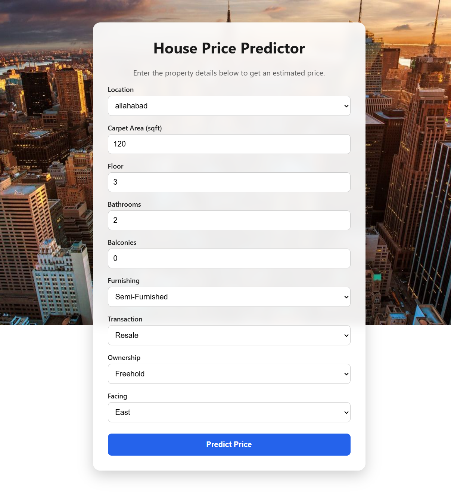

# House Price Prediction — End-to-End Machine Learning Web Application

An end-to-end machine learning web application that predicts Indian residential property prices using a trained Random Forest model. The project includes data preprocessing, model training, a FastAPI backend, and a React + TypeScript frontend.

## Overview

1. **`notebooks/`** — cleans the raw Kaggle dataset, explores it, trains and
   compares two regression models, and exports the winning model as a pickled
   scikit-learn `Pipeline` (preprocessing + regressor bundled together).
2. **`backend/`** — a FastAPI service that loads that pickle once at startup
   and exposes `GET /health` and `POST /predict`.
3. **`frontend/`** — a React + TypeScript + Vite single-page app where a user
   fills in property details and sees the predicted price.

## Architecture

```
┌─────────────┐      POST /predict        ┌──────────────┐      model.predict()    ┌────────────────────┐
│   React SPA │ ───────────────────────▶ │   FastAPI    │ ───────────────────────▶│ house_price.pkl    │
│ (Vite, TS)  │ ◀─────────────────────── │  /health     │ ◀────────────────────── │ (sklearn Pipeline: │
└─────────────┘   {"predicted_price"}     │  /predict    │      predicted price    │ preprocess + RF)   │
                                          └──────────────┘                         └────────────────────┘
                                                 ▲
                                                 │ trained & exported by
                                          ┌──────────────┐
                                          │  Jupyter     │
                                          │  notebook    │
                                          │ (Phase 2)    │
                                          └──────────────┘
```

## Tech stack

| Layer      | Technology |
|------------|------------|
| Modeling   | Python, pandas, scikit-learn (Pipeline + ColumnTransformer), RandomForestRegressor / LinearRegression |
| Backend    | FastAPI, Pydantic v2, Uvicorn, joblib |
| Frontend   | React 18, TypeScript, Vite, React Router |
| Tooling    | pytest + httpx (backend tests), Docker (backend) |

## Project structure

```
house-price-project/
├── notebooks/
│   ├── house_price_model.ipynb   # EDA, cleaning, training, evaluation, export
│   └── data/                     # place house_prices.csv here (not committed)
├── backend/
│   ├── app/
│   │   ├── main.py               # FastAPI app, CORS, model loaded at startup (lifespan)
│   │   ├── api/routes/prediction.py   # GET /health, POST /predict
│   │   ├── core/config.py        # Settings from .env (pydantic-settings)
│   │   ├── schemas/prediction.py # PredictionRequest / PredictionResponse
│   │   ├── services/
│   │   │   ├── preprocessing.py  # Turn a request into a one-row DataFrame
│   │   │   └── inference.py      # Load .pkl, run predict
│   │   └── utils/logging_config.py
│   ├── models/house_price.pkl    # ← copied from the notebook output (see below)
│   ├── tests/test_prediction.py
│   ├── requirements.txt
│   ├── .env.example
│   └── Dockerfile
├── frontend/
│   └── src/
│       ├── api/predictionClient.ts
│       ├── components/PredictionForm.tsx
│       ├── pages/HomePage.tsx | ResultPage.tsx | NotFoundPage.tsx
│       ├── types/prediction.ts
│       └── App.tsx
├── .gitignore
└── README.md
```

## Dataset

**House Price** by Juhi Bhojani — <https://www.kaggle.com/datasets/juhibhojani/house-price>
(~187,000 Indian property listings, file `house_prices.csv`).

Download it with the Kaggle CLI:

```bash
pip install kaggle
# Get your API token: Kaggle -> Settings -> API -> "Create New Token"
# Place kaggle.json in ~/.kaggle/ (or C:\Users\<you>\.kaggle\ on Windows)
kaggle datasets download -d juhibhojani/house-price -p notebooks/data --unzip
```

Or download it manually from the link above and place the CSV in `notebooks/data/`.

## 1. Run the notebook (train + export the model)

```bash
cd notebooks
python -m venv .venv && source .venv/bin/activate   # .venv\Scripts\activate on Windows
pip install jupyter pandas numpy scikit-learn matplotlib seaborn joblib
jupyter notebook house_price_model.ipynb
# Kernel -> Restart & Run All
```

This produces `notebooks/house_price.pkl` and `notebooks/locations.json`. Copy them into
the backend and frontend:

```bash
cp house_price.pkl ../backend/models/house_price.pkl
cp locations.json ../backend/models/locations.json
cp locations.json ../frontend/public/locations.json
```

**Version pinning:** the first notebook cell prints `scikit-learn version: X.Y.Z`.
Update that exact version in `backend/requirements.txt` — a pickle only loads
reliably with the scikit-learn version it was created with.

## 2. Run the backend

```bash
cd backend
python -m venv .venv && source .venv/bin/activate
pip install -r requirements.txt
cp .env.example .env
uvicorn app.main:app --reload
# Swagger UI: http://localhost:8000/docs
pytest
```

### Backend environment variables

| Variable       | Default                  | Description                                  |
|----------------|---------------------------|-----------------------------------------------|
| `CORS_ORIGINS` | `http://localhost:5173`  | Comma-separated list of allowed frontend origins |

## 3. Run the frontend

```bash
cd frontend
npm install
cp .env.example .env
npm run dev
# App: http://localhost:5173
```

### Frontend environment variables

| Variable              | Default                  | Description                     |
|------------------------|-------------------------|---------------------------------|
| `VITE_API_BASE_URL`   | `http://localhost:8000`  | Base URL of the FastAPI backend |

## API reference

### `GET /health`

```bash
curl http://localhost:8000/health
# {"status": "ok"}
```

### `POST /predict`

```bash
curl -X POST http://localhost:8000/predict \
  -H "Content-Type: application/json" \
  -d '{
        "location": "Whitefield",
        "carpet_area_sqft": 1200,
        "floor_num": 3,
        "bathroom": 2,
        "balcony": 1,
        "furnishing": "Semi-Furnished",
        "transaction": "Resale",
        "ownership": "Freehold",
        "facing": "East"
      }'
# {"predicted_price": 6250000.0}
```

## Model metrics

The notebook compares Linear Regression and Random Forest Regressor using MAE, RMSE, and R². The Random Forest model achieved the best overall performance and was selected for deployment.

| Model                           |       MAE      |      RMSE      |       R²       |
|---------------------------------|----------------|----------------|----------------|
| Linear Regression (baseline)    | _run notebook_ | _run notebook_ | _run notebook_ |
| Random Forest Regressor (final) | _run notebook_ | _run notebook_ | _run notebook_ |

## Demo

### Home Page



### Prediction Result


## Features

- Predict house prices from property details
- Interactive React + TypeScript user interface
- FastAPI REST API backend
- Random Forest machine learning model
- Automatic preprocessing using a scikit-learn Pipeline
- Location dropdown loaded dynamically
- Model trained from a real-world Kaggle dataset


## Deliverables checklist

- [x] `notebooks/house_price_model.ipynb` — EDA plots, cleaning, ≥2 models compared, test metrics, model export
- [x] `backend/` — FastAPI app with `/health` + `/predict`, `.env.example`, pinned `requirements.txt`, `pytest` tests
- [x] `frontend/` — React form → result page, `.env.example`, builds with `npm run build`
- [x] `backend/models/house_price.pkl` served by the backend, produced by the notebook
- [x] Root `README.md`
- [x] Clean `.gitignore` (no `node_modules`, `.venv`, `.env`, raw CSV)
- [x] End-to-end demo verified locally


## Author

Ahmed Elsherpiny

- GitHub: https://github.com/A7meoed
- Repository: https://github.com/A7meoed/house-price-prediction